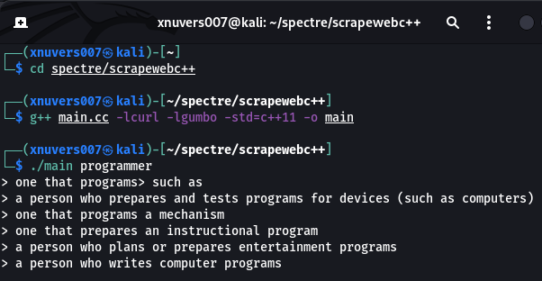

# Scraping website Using C/C++

# Windows :

- 1. Install MinGW
- 2. Install CMake
- 3. Install Git
- 4. Install Visual Studio Code
- 5. Install C/C++ Extension
- 6. Install CMake Tools Extension

<b> Download The Repository First </b>

# Linux :

- 1. Download the repository
- 2. <h3> run file run.sh </h3>
- 3. Install visual studio code / Nano / Vim
    
    ```./run.sh```
    <br />
    or
    <br />
    ``` bash run.sh ```

<br />
<br />
<h3> Compile : </h3>

```g++ main.cc -lcurl -lgumbo -std=c++17 -o main ```
<br />
<br />
<h3> Run : </h3>

```./main devil ```
<br />
<br />

# Image

